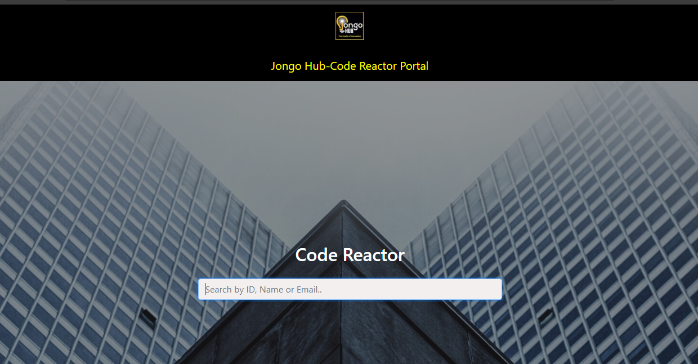

    

# Certificate Search System

Welcome to the Certificate Search System. This system allows users to search for their certificates using the following methods:

## 1. By Name!

Users can search for their certificates by entering their full name. The system performs a case-insensitive search to match the entered name with the names in the database. Ensure that you enter both your first and last name correctly.

Example: 

John Doe

## 2. By CRI Code

Each certificate is associated with a unique CRI code. Users can search for their certificates by entering this code. The format of the CRI code is `CRIxxRIxxx`, where `xx` and `xxx` are digits.

Example: 
CRI24RI001

## 3. By GitHub Email

Users can also search for their certificates using the email address associated with their GitHub account. Enter the full email address to retrieve the certificate.

Example: 
example@gmail.com

## Usage Instructions

1. **Enter your search query**: Use the search bar to enter your name, CRI code, or GitHub email.
2. **View results**: The system will display the results in a formatted list. If a certificate is found, you will see a link to download the PDF. If no results are found, you will receive a notification to try again with a different query.
3. **Download your certificate**: Click on the download link to get your certificate in PDF format.

## Screenshot

## Contributing

We welcome contributions! If you find any issues or have suggestions for improvements, feel free to open an issue or submit a pull request.

## License

This project is licensed under the MIT License.
